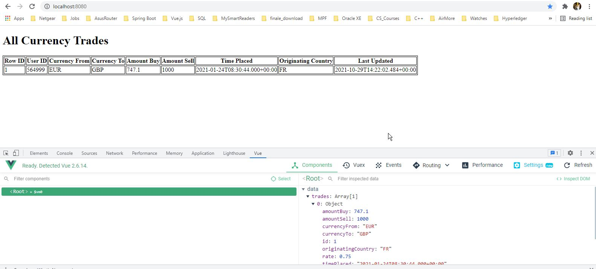
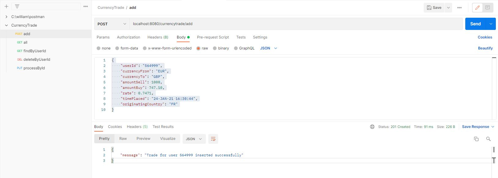
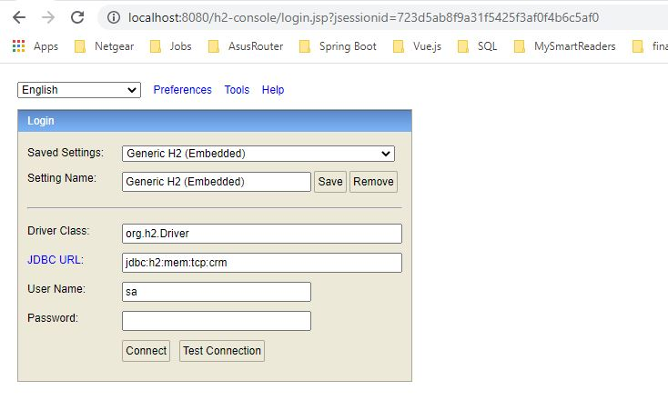
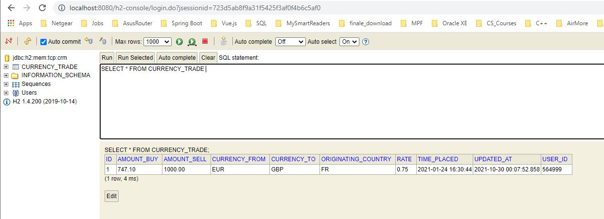

# CurrencyTrade 

This is a very simple Spring Boot RESTful API application that basically ingests current trade records and performs simple CRUD operations. All operations are offered by the API backend service. The webpage is for viewing all current records in database only. For quick prototyping purpose, the H2 in-memory database is used.

## API Reference

#### 1. Get all trades in database

```http
  GET /currencytrade/all
```

| Parameter | Type     | Description                |
| :-------- | :------- | :------------------------- |
| `N/A`     | ` `      | Not needed |

Example API link:
```http
localhost:8080/currencytrade/all
```
#### 2. Get all trades for user

```http
  GET /currencytrade/find/${userId}
```

| Parameter | Type     | Description                       |
| :-------- | :------- | :-------------------------------- |
| `userId`  | `number` | **Required**. Id of user |

Example API link:
```http
localhost:8080/currencytrade/find/564999
```
#### 3. Create new trade record

```http
  POST /currencytrade/add/
```

| Parameter | Type     | Description                       |
| :-------- | :------- | :-------------------------------- |
| `N/A`  | ` ` | Not needed |

Sample JSON record for this operation (if use Postman, select "raw" under "Body" tab, and choose "JSON" as document type, then paste below sample):
```json
{
    "userId": "564999",
    "currencyFrom": "EUR",
    "currencyTo": "GBP",
    "amountSell": 1000,
    "amountBuy": 747.10,
    "rate": 0.7471,
    "timePlaced": "24-JAN-21 16:30:44",
    "originatingCountry": "FR"
}
```
Example API link:
```http
localhost:8080/currencytrade/add
```
#### 4. Process trade record

```http
  PUT /currencytrade/process/${id}
```

| Parameter | Type     | Description                       |
| :-------- | :------- | :-------------------------------- |
| `id`  | `number` | Unique database record ID |

Update/patch the "Amount Sell" value:

#### amountSell = multiply(amountBuy, rate)

Example API link:
```http
localhost:8080/currencytrade/process/1
```
#### 5. Delete trade records for a user

```http
  DELETE /currencytrade/delete/{userId}
```

| Parameter | Type     | Description                       |
| :-------- | :------- | :-------------------------------- |
| `userId`  | `number` | **Required**. Id of user |

Delete all records belonging to a user

Example API link:
```http
localhost:8080/currencytrade/process/1
```


## Authors

- [@William Ho](https://www.github.com/whokc)


## Installation

Simply download the project mkt_trade_processor from github. The project source can be viewed and edited using IntelliJ IDEA. 

To download dependencies, simply open a Terminal/Command Prompt and go to the project directory (mkt_trade_processor), and use below mvn command.

```bash
mvn package
```
    
## Usage/Examples

Use Postman (or any similar tool) to call the APIs.

Web page (read-only) can be access via the link:
```http
http://localhost:8080/
```
## Screenshots







## Run Locally

Clone the project

```bash
  git clone https://link-to-project
```

Go to the project directory

```bash
  cd mkt_trade_processor
```

Start the server

```bash
  java -jar ./target/mkt_trade_processor-0.0.1-SNAPSHOT.jar
```

The server will be running on localhost:8080

The in-memory DB can be accessed via the link:
```http
http://localhost:8080/h2-console
```
H2 DB Login:
```bash
Driver Class: org.h2.Driver
JDBC URL: jdbc:h2:mem:tcp:crm
User Name: sa
Password: <blank>
```
Use SQL to check data:
```sql
SELECT * FROM CURRENCY_TRADE;
```

## Running Tests

To run tests, run the following command in project folder.

```bash
  mvn test
```

